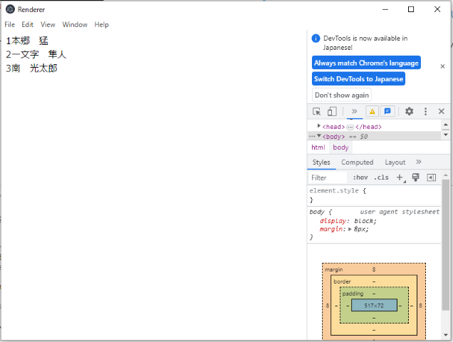
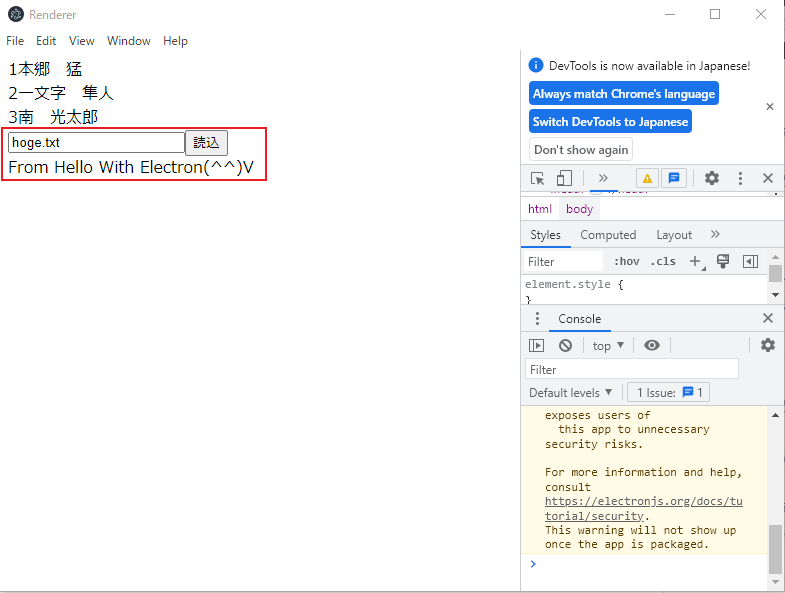

# Angular+Electron開発テンプレート  
## 概要  
AngularとElectronを用いたデスクトップアプリケーションを開発するためのテンプレートです。  
以下の記事、リポジトリを参考にさせていただき、作成しました。  
- [Qiita:Electron + Angular は、こうしたらいいんじゃないかなプラクティス](https://qiita.com/sengoku/items/1fd655613c9ca20e37c1)  
- [maximegris\/angular-electron](https://github.com/maximegris/angular-electron)  

当リポジトリをクローンし、`npm run serve`コマンドを実行すると下図のような画面が表示されます。  
  
`"1本郷 猛"~"3南 光太郎"`の部分に注目してください。この部分はリポジトリ同梱のモックデータ`./mock/users.json`を参照して出力しています。  
```json:./mock/users.json
[
  { "userId": 1, "userName": "本郷　猛" }, 
  { "userId": 2, "userName": "一文字　隼人" }, 
  { "userId": 3, "userName": "南　光太郎"}
]
```
`Angular`単体では、OS上のファイルにはアクセスできませんが、`Electron`の機能によりNode.jsのAPIを使用して、ファイルを参照し、その内容を`Angular`で作成したフロントサイドに描画しています。  

## 環境  
- Windows 10 pro 22H2
- Node.js v16.15.0  
- Angular 16  
- Electron 23  

## フォルダ構成  
```
(root)
  ├/assets
  │  └/icon
  │     └icon.ico          # アプリのアイコン
  ├/dist                   # メインプロセス、Angularのビルド先
  ├/node_modules
  ├/out                    # ElectronForgeによって生成される成果物の出力先(クローン時には存在しない)
  ├/projects
  │  ├/main                # メインプロセス
  │  │  ├/src
  │  │  │  ├main.ts
  │  │  │  └preload.ts
  │  │  └tsconfig.json     # メインプロセスのtsconfig.json
  │  ├/renderer            # Angularプロジェクト(レンダラープロセス)
  │  │  ├/src
  │  │  └tsconfig.app.json 
  │  └/types
  │     └preload.d.ts      # 型定義ファイル メインプロセスで作成したメソッド等をAngularに認識させるためのファイル。
  ├angular.json
  ├forge.config.json
  ├package-lock.json
  ├package.json
  └tsconfig.json
```

## 使用方法  
### 環境構築
1. 当リポジトリをクローン  
    ```powershell
    git clone url .
    ```
1. npm install
    ```powershell
    npm install
    ```
### 開発モードで実行  
```powershell
npm run serve
```
メインプロセスのコードを修正した場合、ウィンドウが再起動します。  
Angularプロジェクトのコードを修正した場合、リロードします。  

### ビルド  
メインプロセスとレンダラープロセスであるAngularのコードをビルドします。  
distフォルダ以下に生成されます。  
```powershell
npm run build
```

### パッケージ化
exeファイルを作成します。  
ビルド後に実行します。  
```powershell
npm run package
```

### Node.jsの機能を用いたメソッドの追加    
Node.jsの機能を用いたメソッドの追加方法を示します。  
[(公式)プロセス間通信](https://www.electronjs.org/ja/docs/latest/tutorial/ipc)  
`readTextFile(targetFilePath)`という引数で指定したファイルパスのテキストファイルをリードするメソッドを追加するとします。画面でユーザーが指定したファイル名を`readTextFile`メソッドを用いて読込み、その内容を画面に表示させるものとします。つまりレンダラーでイベントを発火し、メインプロセスでそれを受けて処理を行い、レンダラーに返します。  
リード対象の仮データを`mock/hoge.txt`とします。内容は何でもよいです。  
```text:mock/hoge.txt
From Hello With Electron(^^)V
```
1. メインプロセスにメソッド追加  
    `main/src/main.ts`にテキストファイルをリードするメソッドを追加します。  
    ```typescript:main/src/main.ts
    ...
    import * as fs from 'fs';
    ...

    const readTextFile = async (event: Event, targetPath: string): Promise<string> => {
      //当例ではmockフォルダ配下のファイルを参照するようにしています。
      return fs.readFileSync(path.join(__dirname, '../mock', targetPath), 'utf8');
    };
    ```

1. メインプロセスで`ipcMain.handle`でイベントをリッスン  
    `main/src/main.ts`  
    ```typescript:main/src/main.ts
    ...
    app.whenReady().then(async () => {
      ...
      ipcMain.handle('readTextFile', readTextFile)
      ...
    });
    ...
    ```
1. プリロードスクリプトで`ipcRenderer.invoke`で`readTextFile`を公開  
    `main/src/preload.ts`  
    ```typescript:main/src/preload.ts
    contextBridge.exposeInMainWorld('fileAPI', {
      readTextFile: (targetPath: string): Promise<string> => {
        return ipcRenderer.invoke('readTextFile', targetPath)
      }, 
    });
    ```
1. 型定義ファイルを修正  
    `types/preload.d.ts`
    ```typescript
    export interface FileAPI {
      readTextFile: (targetPath: string) => Promise<string>;
    }

    declare global {
      interface Window {
        ...
        fileAPI: FileAPI;
      }
    }
    ```
    以上でレンダラープロセスで`window.fileAPI.readFileText()`が使用できるようになります。  
1. レンダラープロセスの修正  
    ではレンダラープロセスにreadFileTextメソッドの呼び出しを追加します。  
    `renderer/src/app/app.component.ts`  
    ```typescript
    @Component({
      ...
      template: `
        ...
        <div>
          <input 
            type="text" 
            [(ngModel)]='targetPath'
          >
          <button (click)="readFile()">読込</button>
          <div *ngIf="readData">{{readData}}</div>
        </div>
        ...
      `, 
      ...
    })
    export class AppComponent implements OnInit {
      ...
      //読み込むファイルパス
      targetPath = `hoge.txt`;
      //読み込んだファイルの内容
      readData = '';  
      ...
      readFile() {
        //テキストファイルを読み込む
        window.fileAPI.readTextFile(this.targetPath).then(
          data => this.readData = data
        );
      }
    }
    ```
    以上の流れでメソッドを追加します。  
    下図はinput要素で指定したファイルを読込ボタン押下時に読込、下部に読み込んだ内容を表示している様子です。  
      


## 参考URL
- [Squirrel Startup Exe Icon missing #1790](https://github.com/Squirrel/Squirrel.Windows/issues/1790)  
  
以上